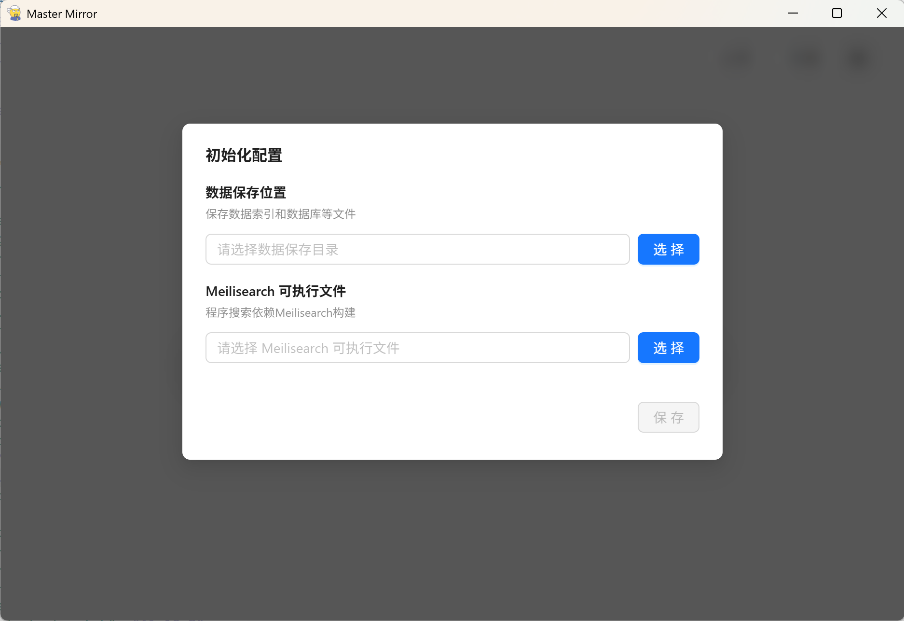
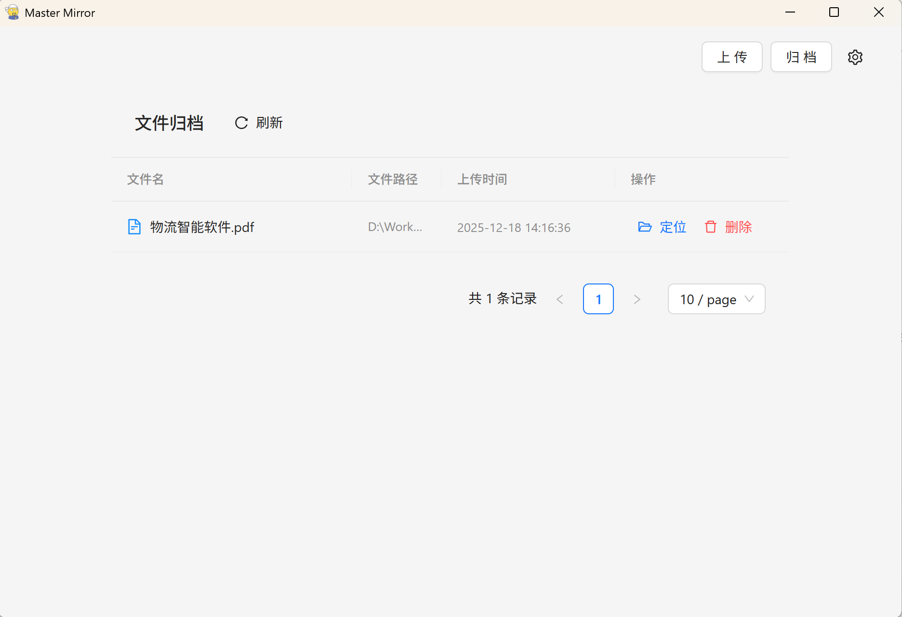

# MasterMirror

MasterMirror 是一个基于 Electron + Vue 3 构建的高性能文档检索系统。

传统文档检索系统仅支持文件名搜索，MasterMirror 集成 **Meilisearch** 搜索引擎，支持**全文检索**。

**即使有上千个文件，输入任意关键字，也能在毫秒级内检索出包含该内容的所有文档结果。**

支持系统：Windows

目前只是针对Nodejs全栈技术的学习项目，有许多不完善的地方。

## ✨ 亮点功能

- ✅ **全文检索**：依托 Meilisearch 强大的检索引擎，实现海量文档内容的秒级搜索。
- ✅ **文件上传**：可直接拖拽文件到页面上传或在专门的上传窗口上传。
- ✅ **归档管理**：提供可视化的归档页，查看和管理已上传的文件列表。
- ⬜ **搜索筛选**：支持按时间、格式等条件进行精确筛选。
- ⬜ **云端 Meilisearch**：支持连接云端 Meilisearch 实例，实现多端同步检索。
- **格式支持**：
  - ✅ PDF
  - ⬜ Word (docx/doc)
  - ⬜ Excel (xlsx/xls)
  - ⬜ TXT

## 开始使用

1. 从 [Release](https://github.com/lancer1126/master-mirror/releases) 中下载MasterMirror最新安装包。
2. 下载 [Meilisearch](https://github.com/meilisearch/meilisearch/releases) 可执行文件（目前只支持Windows版），**下载好后无需手动启动，程序启动后会自动启动Meilisearch**。
3. 启动MasterMirror软件，初次启动时需要选择数据保存位置和Meilisearch执行文件的位置。

   

4. 选择好后进入首页，点击上传或者直接拖拽文件到页面上进行上传并构建索引。

   

5. 点击归档查看文件列表，再次点击归档回到首页。

   

## 🛠️ 技术栈

- **桌面框架**: Electron
- **前端框架**: Vue 3 + TypeScript + Vite
- **UI组件库**: Ant Design Vue
- **状态管理**: Pinia
- **搜索引擎**: Meilisearch (提供核心的高效全文检索能力)
- **后端逻辑**: Node.js (Electron Main Process)
- **数据保存**: 索引数据由Meilisearch保存，其余数据由内置SQLite保存

## 📦 开发与构建

### 坑点提示

- **Node.js**: 版本需 **>= 22.18.0**
- **Meilisearch**: 无需手动启动 Meilisearch 服务。本项目启动时，会自动启动 Meilisearch 实例。
- **依赖安装**: 项目使用Electron构建桌面程序，better-sqlite3作为内置数据库组件，在安装依赖时可能会遇到网络问题，需要手动配置代理。

### 常用命令

```bash
# 安装项目依赖
pnpm install

# 启动开发环境 (Electron + Vite)
pnpm dev

# 构建 Windows 安装包
pnpm build:win
```
