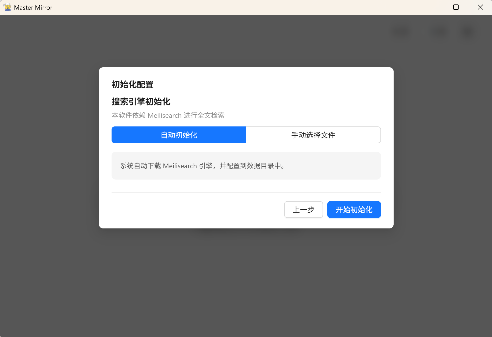
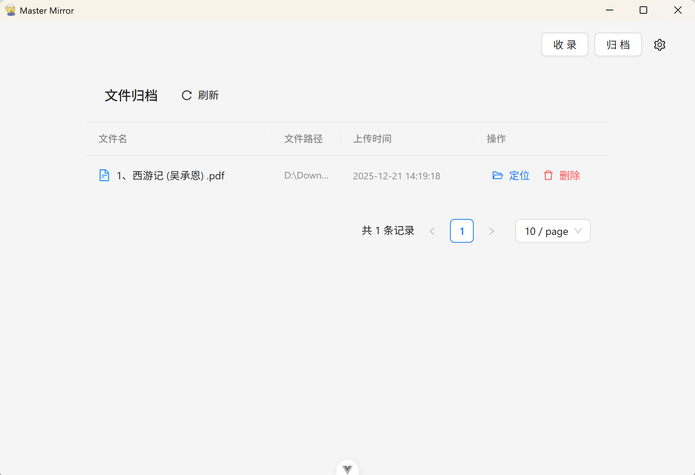

# MasterMirror

MasterMirror 是一个基于 Electron + Vue 3 构建的高性能文档检索系统，数据完全保存在本地。

传统文档检索系统仅支持文件名搜索，MasterMirror 集成 **Meilisearch** 搜索引擎，支持跨文档的**全文检索**。

**即使有上千个文件，输入任意关键字，也能在毫秒级内检索出包含该内容的所有文档结果。**

支持系统：Windows

目前只是针对 Nodejs 全栈技术的学习项目，有许多不完善的地方。

## ✨ 内容介绍

- ✅ **文件收录**：选择本地文件传入程序中通过 Meilisearch 构建索引。
- ✅ **全文检索**：依托 Meilisearch 强大的检索引擎，实现海量文档内容的秒级搜索。
- ✅ **归档管理**：提供可视化的归档页，查看和管理已收录的文件列表。
- ⬜ **搜索筛选**：支持按时间、格式等条件进行精确筛选。
- **格式支持**：
  - ✅ PDF
  - ⬜ Word (docx/doc)
  - ⬜ TXT

## 开始使用

1. 安装好后首次启动需要选择数据保存位置，数据包括Meilisearch相关文件和数据库文件等。

2. 然后需要初始化Meilisearch程序，选择自动初始化，将从GitHub/Gitee的Release中自动下载Meilisearch的执行文件；若选择手动选择文件，可以从本地硬盘中直接选用Meilisearch执行文件（暂时只支持windows版），跳过下载。

   

3. 初始化配置好结束后，进入首页。点击收录按钮或者直接拖拽文件到页面上，将文件导入系统。

   

4. 点击归档按钮可查看收录的文件列表，再次点击归档按钮回到首页。

   

## 🛠️ 技术栈

- **桌面框架**: Electron
- **前端框架**: Vue 3 + TypeScript + Vite
- **UI组件库**: Ant Design Vue
- **状态管理**: Pinia
- **搜索引擎**: Meilisearch (提供核心的高效全文检索能力)
- **后端逻辑**: Node.js (Electron Main Process)
- **数据保存**: 索引数据由Meilisearch保存，其余数据由内置SQLite保存

## 📦 开发与构建

### 坑点提示

- **Node.js**: 版本需 **>= 22.18.0**
- **Meilisearch**: 无需手动启动 Meilisearch 服务。本项目启动时，会自动启动 Meilisearch 实例。
- **依赖安装**: 项目使用Electron构建桌面程序，better-sqlite3作为内置数据库组件，在安装依赖时可能会遇到网络问题，需要手动配置代理。

### 常用命令

```bash
# 安装项目依赖
pnpm install

# 复制 .env.example 为 .env
copy .env.example .env

# 启动开发环境 (Electron + Vite)
pnpm dev

# 构建 Windows 安装包
pnpm build:win
```
